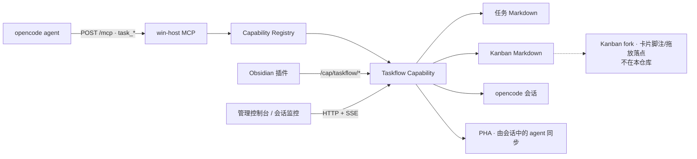

# Taskflow（任务文档 MCP）现状设计盘点

> 盘点基线：`aleygey/win-console` `main@a4a2e040c28f4d2b16b70a63e6ac11eb8d0d4fe8`，2026-07-14。本文只描述当前设计与已观察到的问题，不包含重构方案。

## 1. 一句话定位

当前 Taskflow 已经不只是“任务文档 MCP”，而是一套以 Obsidian Kanban 为中心的任务协作子系统：它同时负责 Markdown 文档格式、看板状态、文件索引、任务与会话关联、会话启动、PHA 同步、跨系统路径映射和前端联动。

代码给出的产品原则是：

- 人驱动，系统不自动派发任务；
- 看板列是任务状态的唯一来源；
- 一个 Markdown 文档只有被某个 Kanban 看板以 `[[链接]]` 引用后，才被系统视为任务；
- 任务文档保存结构化记录，`sessions[]` 连接任务与 opencode 会话；
- agent 优先通过 `task_*` 工具写文档，工具不可用时又允许直接编辑文件。

来源：[Taskflow 文件头](https://github.com/aleygey/win-console/blob/a4a2e040c28f4d2b16b70a63e6ac11eb8d0d4fe8/src/host/capabilities/taskflow.ts#L1-L16)。

## 2. 当前系统结构



通用调用链为：

```text
POST /mcp
→ server.handleMcp()
→ registry.tools()
→ bindTool(Taskflow HostContext)
→ mcpDispatch(tools/call)
→ task_* handler
→ 扫描/读取/整文件写回 Markdown
→ taskflow:changed
→ SSE 通知前端刷新
```

MCP 是一个无额外依赖的 Streamable HTTP 请求/响应子集，只实现 `tools/list` 和 `tools/call`；没有 MCP resources 或 prompts。任务启动提示词虽然很长，但它是通过 chat 发送的普通消息，不是 MCP prompt。

来源：[MCP dispatch](https://github.com/aleygey/win-console/blob/a4a2e040c28f4d2b16b70a63e6ac11eb8d0d4fe8/src/host/mcp.ts#L1-L64)、[HTTP MCP 入口](https://github.com/aleygey/win-console/blob/a4a2e040c28f4d2b16b70a63e6ac11eb8d0d4fe8/src/host/server.ts#L222-L242)、[Registry 工具聚合](https://github.com/aleygey/win-console/blob/a4a2e040c28f4d2b16b70a63e6ac11eb8d0d4fe8/src/host/registry.ts#L285-L324)。

## 3. 数据与事实来源

系统没有数据库，核心持久化就是任务文档和看板两个 Markdown 文件。

| 信息 | 当前事实来源 | 备注 |
| --- | --- | --- |
| 任务身份 | 文档 basename | 不是 UUID；同名文件会产生歧义 |
| 标题 | H1 → `frontmatter.title` → basename | 多级回退 |
| 状态 | Kanban 卡片所在列 | 不写回任务 frontmatter |
| 项目 | `frontmatter.project` → 看板项目名 | 看板项目名又有多级推导 |
| 类型 | `frontmatter.type` | 可由 `task_set_field` 修改 |
| 任务待办 | 文档 `## 待办` 下的 checkbox | 与会话自己的 `todowrite` 是两套进度 |
| 会话关联 | `frontmatter.sessions[]` | “继续”默认取最后一个 session |
| PHA 关联 | `frontmatter.pha_issue` | 同步本身交给 agent 执行 |
| 正文记录 | `---` 后的编号章节 | 工具最多管理到三级编号 |
| 阶段日志 | 文末 `## 日志` 表格 | 时间、会话尾号、记录 |
| 运行索引 | 内存 `Registry` | 轮询或请求时由全量扫描重建 |

运行时 `TaskMeta` 包含 `id/title/project/type/status/board/sessions/pha_issue/todos/path/mtimeMs`。内存索引同时按规范化路径和小写 basename 建表。

来源：[TaskMeta 与 Registry](https://github.com/aleygey/win-console/blob/a4a2e040c28f4d2b16b70a63e6ac11eb8d0d4fe8/src/host/capabilities/taskflow.ts#L760-L787)、[注册表扫描](https://github.com/aleygey/win-console/blob/a4a2e040c28f4d2b16b70a63e6ac11eb8d0d4fe8/src/host/capabilities/taskflow.ts#L817-L904)。

## 4. 任务文档契约（v5）

新任务模板为：

```markdown
---
project: 项目名
type: 类型
sessions: []
pha_issue: ""
created: YYYY-MM-DD
---
# 任务标题

## 待办
- [ ] 待办项

---

## 1 顶级章节
### 1.1 小节
#### 1.1.1 三级小节

---

## 日志
| 时间 | 会话 | 记录 |
| --- | --- | --- |
```

这不是单纯模板。代码会主动“编译” agent 提交的 Markdown：

- 自动建立和修补固定区块；
- 解析、插入、替换、追加并重排章节；
- 把任意层级标题映射成最多三级编号；
- 深层标题降为粗体；
- 删除章节内水平线；
- 识别代码围栏并自动补闭合；
- 自动添加顶级章分隔线；
- 可在写章节时顺带勾选一个待办。

相关实现约 450 行，已经相当于一个面向特定 Markdown 方言的编辑器/编译器。

来源：[文档布局与待办](https://github.com/aleygey/win-console/blob/a4a2e040c28f4d2b16b70a63e6ac11eb8d0d4fe8/src/host/capabilities/taskflow.ts#L102-L245)、[章节重排与写入](https://github.com/aleygey/win-console/blob/a4a2e040c28f4d2b16b70a63e6ac11eb8d0d4fe8/src/host/capabilities/taskflow.ts#L247-L550)。

## 5. MCP 工具面

Taskflow 当前向所有连接到 win-host MCP 的 agent 暴露 10 个工具。

| 分组 | 工具 | 当前职责 |
| --- | --- | --- |
| 查询 | `task_list` | 全量扫描并输出所有看板、列和任务 |
| 查询 | `task_get` | 读取全文或指定编号章节 |
| 创建 | `task_create` | 建文档、套模板、选看板、插卡片 |
| 文档编辑 | `task_todo` | 新增、勾选、取消待办 |
| 文档编辑 | `task_write_section` | replace/append 编号章节，可同时完成待办 |
| 文档编辑 | `task_log` | 追加阶段日志表行 |
| 文档编辑 | `task_issue` | 自动创建“现象/根因/解决”章节的语法糖 |
| 元数据 | `task_set_field` | 只允许更新 `type` / `pha_issue` |
| 看板 | `task_set_status` | 移动卡片到看板列并更新 checkbox |
| 维护 | `task_normalize` | 把旧文档补齐到 v5 布局 |

来源：[Taskflow tools](https://github.com/aleygey/win-console/blob/a4a2e040c28f4d2b16b70a63e6ac11eb8d0d4fe8/src/host/capabilities/taskflow.ts#L1137-L1501)。

其中 `task_issue` 是 `task_write_section` 的语法糖；`task_normalize` 是迁移/维护能力，但也进入了日常公共工具面。工具描述不仅说明参数，还承担大量 agent 行为规则，例如“先列任务”“信息不明确先询问用户”“不要写过程碎片”等。

## 6. 非 MCP 的 Taskflow 接口

Taskflow 另有 7 个给前端和 Obsidian 使用的 HTTP 路由：

| 路由 | 调用方/作用 |
| --- | --- |
| `GET /cap/taskflow/tasks` | 会话面板取任务、会话关联及看板信息 |
| `POST /cap/taskflow/scan` | 手动重建索引 |
| `POST /cap/taskflow/vault` | Obsidian 上报当前 vault |
| `POST /cap/taskflow/launch` | 创建或继续任务会话 |
| `POST /cap/taskflow/task/sync-pha` | 向任务会话发送 PHA 同步指令 |
| `POST /cap/taskflow/associate` | 任务与 session 关联 |
| `POST /cap/taskflow/dissociate` | 解除任务与 session 关联 |

来源：[Taskflow routes](https://github.com/aleygey/win-console/blob/a4a2e040c28f4d2b16b70a63e6ac11eb8d0d4fe8/src/host/capabilities/taskflow.ts#L1515-L1596)。

会话启动没有做成 MCP 工具，而由 Obsidian/前端调用 HTTP。它会复用 `sessions[]` 的最后一个会话或创建新会话，将一整份任务契约和当前文档发给 agent。PHA 同步复用同一调用链，只替换成 PHA 专用提示词。

来源：[启动契约与会话编排](https://github.com/aleygey/win-console/blob/a4a2e040c28f4d2b16b70a63e6ac11eb8d0d4fe8/src/host/capabilities/taskflow.ts#L1015-L1130)。

## 7. 配置面

Taskflow 在通用“管理 → 能力”卡片内提供 5 项配置：

| 配置 | 作用 |
| --- | --- |
| `vaultDir` | 一个或多个扫描根；Obsidian 当前 vault 也会并入 |
| `doneColumns` | 哪些看板列视为完成，并自动勾选卡片 |
| `pathMap` | Windows 路径映射到 WSL/虚拟机路径 |
| `pollSeconds` | 注册表全量刷新间隔 |
| `sessionModel` | 启动任务会话时可选模型 |

这些配置由 daemon 的全局 JSON 配置持久化；Obsidian 临时上报的 vault 只在内存中保存。

来源：[Taskflow Capability 配置](https://github.com/aleygey/win-console/blob/a4a2e040c28f4d2b16b70a63e6ac11eb8d0d4fe8/src/host/capabilities/taskflow.ts#L1602-L1665)、[配置存储](https://github.com/aleygey/win-console/blob/a4a2e040c28f4d2b16b70a63e6ac11eb8d0d4fe8/src/host/config.ts#L32-L82)。

## 8. 当前用户流程与界面归属

### 创建和编辑任务

```text
agent 调 task_list
→ 确认看板/目录/列
→ task_create 建文档并插入看板
→ task_todo / task_write_section / task_log 持续写文档
→ task_set_status 移动看板卡片
```

### 从 Obsidian 启动工作

```text
打开任务文档
→ 命令面板选择“启动/继续”或“另开会话”
→ Obsidian 调 /launch
→ Taskflow 创建/复用 session 并注入任务契约
→ 控制台打开通用“会话监控”卡墙
```

启动接口已经返回具体 `sessionId`，但 Obsidian 成功后只打开通用会话面板，没有深链到该会话，用户还需要在卡墙中寻找。

### 关联和跳转

- 会话卡拖到 Obsidian Kanban 卡片：建立关联；
- 会话卡上的任务 chip：让 Obsidian 打开任务文档；
- Kanban fork 的卡片脚注：打开对应 session；
- 另开会话、同步 PHA：只在 Obsidian 命令面板中出现。

Taskflow 已没有自己的可见主面板。真实 UI 分布在 Obsidian 文档、外部 Kanban fork、会话监控和管理页中。

来源：[控制台实际面板注册](https://github.com/aleygey/win-console/blob/a4a2e040c28f4d2b16b70a63e6ac11eb8d0d4fe8/src/console-ui/entry.tsx#L11-L20)、[Obsidian Taskflow 命令](https://github.com/aleygey/win-console/blob/a4a2e040c28f4d2b16b70a63e6ac11eb8d0d4fe8/src/obsidian-plugin/main.ts#L30-L76)、[会话与任务关联](https://github.com/aleygey/win-console/blob/a4a2e040c28f4d2b16b70a63e6ac11eb8d0d4fe8/src/panels/panels/sessions/index.tsx#L650-L720)。

## 9. 为什么当前设计显得重

### 9.1 一个 Capability 包含九类职责

`taskflow.ts` 共 1,666 行，包含：

1. 自制 frontmatter parser/serializer；
2. Markdown 固定布局与 todo 编辑；
3. 章节编号、消毒、重排和迁移；
4. Kanban parser/mutator；
5. Windows ↔ WSL/VM 路径映射；
6. 全 vault 文件扫描与内存索引；
7. 文档模板和 agent 长提示；
8. opencode session/PHA 编排；
9. 10 个 MCP tools、7 个 HTTP routes、配置、事件和轮询生命周期。

所以现在的复杂度不是“工具有点多”，而是产品边界没有切开。

### 9.2 同一任务有五套相邻状态

- 看板列：任务状态；
- 文档 checkbox：任务待办进度；
- session `todowrite`：agent 当前执行进度；
- session running/retry/ask/idle：会话运行状态；
- `pha_issue`：外部同步关联状态。

它们都合理，但没有一个统一的任务表面解释这些区别。会话卡显示的进度还是 session todo，不是任务文档 todo。

### 9.3 用户链路跨越过多语境

一次任务可能在“文档 → Kanban → 命令面板 → 会话卡墙 → 会话弹窗 → 管理配置”之间移动。Taskflow 没有自己的稳定主页，核心动作又依赖命令面板、hover、tooltip 和跨 iframe 拖放。

### 9.4 规则重复且已经漂移

同一套文档行为规则同时存在于源码注释、工具 description 和 `launchContract()` 长提示中。当前已经出现明显不一致：

- 顶层说文件本身也是接口；启动契约先说只能通过工具写，随后又允许直接编辑；
- `task_create` 文案要求列不明确时必须询问，但 schema 不要求 `column`，实现会默认第一列；
- 代码注释仍写“Obsidian 切文档联动会话面板”，实际功能已下线。

### 9.5 旧设计残留制造假入口

- 独立任务面板已经删除；
- `taskflowCapability` 仍声明 `hasPanel: true`；
- 管理页因此仍显示“面板”徽章；
- App 仍保留 `taskflow` rail icon；
- 配置帮助仍提及已经不存在的面板；
- 卡片完成度徽章已下线，但旧的 `applyCardBadges()` 仍留在实现中；
- `task_normalize` 作为版本迁移工具仍占据所有 agent 的公共工具面。

### 9.6 视觉重量来自“壳套壳”

Obsidian 内嵌整个控制台 iframe，内部又有 232px rail、panel header、卡片和弹窗。代码注释直接描述为：

```text
folders → note → console rail → panel
```

只能由用户手动把 rail 折叠到 64px。管理页又是“页面卡片 → 能力卡片 → 工具 chip → 配置内嵌卡片”，把开发者结构暴露给了任务用户。

## 10. 当前可靠性与边界问题

这些不一定是这轮视觉精简的范围，但会影响后续设计边界：

- `task_list` 和 `GET /tasks` 都会全量扫描 vault；扫描还可能为了清旧徽章而写看板，因此名义上的读取带写副作用；
- 任务和看板均采用同步 read-modify-write 整文件覆盖，没有文件锁、CAS、mtime 冲突检查或原子替换；Obsidian 与多个 agent 并发写时可能丢更新；
- 新建文档与加入看板不是事务；后者失败会留下一个按系统定义“不算任务”的孤立文档；
- basename 充当任务 id，同名文件/多看板引用的结果依赖扫描顺序；
- `/mcp`、`/config` 和 Taskflow 业务 API 没有统一鉴权，服务又监听所有接口且 CORS 为 `*`；
- MCP 返回 session id 但不保存/校验 session 状态；工具 `inputSchema` 也没有通用运行时校验；
- MCP 声明 `tools.listChanged: false`，但通用插件平台实际上允许工具动态出现和消失。
- 当前 `builtinCapabilities` 已有 6 个能力，`smoke.ts` 仍断言 5 个（注册外部 demo 后断言 6 个），说明主干上的架构验证已经与能力列表漂移；仓库中也没有纳入常规脚本的 Taskflow 专项测试。

来源：[README 安全说明](https://github.com/aleygey/win-console/blob/a4a2e040c28f4d2b16b70a63e6ac11eb8d0d4fe8/README.md#L119-L126)、[全接口监听与路由](https://github.com/aleygey/win-console/blob/a4a2e040c28f4d2b16b70a63e6ac11eb8d0d4fe8/src/host/server.ts#L42-L124)、[同步写回](https://github.com/aleygey/win-console/blob/a4a2e040c28f4d2b16b70a63e6ac11eb8d0d4fe8/src/host/capabilities/taskflow.ts#L979-L984)、[过时的 smoke 数量断言](https://github.com/aleygey/win-console/blob/a4a2e040c28f4d2b16b70a63e6ac11eb8d0d4fe8/src/host/smoke.ts#L91-L100)。

## 11. 为下一轮重设计划出的边界

当前能力可以先按三层重新理解；这只是盘点分层，不是最终方案：

| 层 | 包含内容 | 当前是否混在 Taskflow 内 |
| --- | --- | --- |
| A. 任务文档核心 | 发现、读取、创建、修改待办、写正文、更新少量元数据 | 是 |
| B. 工作流编排 | Kanban 状态、任务↔session 关联、启动/继续会话 | 是 |
| C. 外部集成 | Obsidian、Kanban fork、PHA、路径映射、轮询、SSE/UI | 是 |

后续精简前最关键的产品判断是：第一阶段究竟要重做“A. 任务文档核心”，还是继续把 A+B+C 都叫“任务文档 MCP”。如果目标是先减重，A 是最自然的第一条边界。
